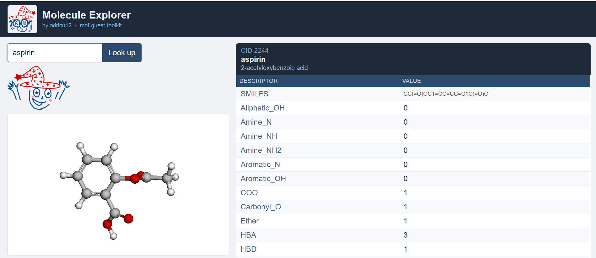

#  mof-guest-toolkit

A Python package of helper utilities for computational chemistry workflows.
Originally developed during my Master's thesis at TU Dresden, and extended for general use
across MOF research, coursework, and independent projects.

The package provides command-line tools and importable Python functions for:


- [Quick interactive exploration of molecules](#example-1--interactive-3d-viewer)
- [Computing a specific RDKit descriptor for a molecule](#example-2--check-a-single-rdkit-descriptor)
- [Getting descriptors for a set of molecules](#example-4--batch-descriptor-computation)
- [Getting 3D coordinate files of molecules](#example-5--generate-3d-structure-files)

<br clear="both">

Coming soon:


- Generating HPC submission scripts
- Restarting failed or incomplete geometry optimisations
- Generating topology files for LAMMPS MD simulations

<br clear="both">


- Parsing geometry optimisation outputs from AMS/ORCA
- Analysing normal modes and gradient convergence
- Analysing LAMMPS trajectory files
- Structure checker

<br clear="both">


- Solution preparation calculator (concentrations, dilutions)
- UV–Vis calibration tools
- PXRD analysis and standardised laboratory plots

<br clear="both">

---

## Requirements

- [Miniconda](https://docs.conda.io/en/latest/miniconda.html) or Anaconda (recommended)
- Git
- An internet connection (for PubChem API calls)

> **Note:** The conda install path is recommended because it pulls RDKit from `conda-forge`,
> which provides the most reliable binary dependencies.
> A pure `pip install` is also supported (RDKit has been pip-installable since 2022).

---

## Installation

### Option A — conda (recommended)

```bash
git clone https://github.com/adricu12/mof-guest-toolkit.git
cd mof-guest-toolkit
conda env create -f environment.yml
conda activate mof-toolkit
```

### Option B — pip only

```bash
git clone https://github.com/adricu12/mof-guest-toolkit.git
cd mof-guest-toolkit
pip install -e .
```

Activate the conda environment every time you open a new terminal session.
To deactivate: `conda deactivate`.

---

### Verify the installation

```bash
rdkit_check_descrpt 3033 TPSA
```

Expected output:

```
CID         : 3033
IUPAC_Name  : 2-(2,6-dichloroanilino)phenylacetic acid
Common_Name : Diclofenac
SMILES      : OC(=O)Cc1ccccc1Nc1c(Cl)cccc1Cl
Function    : TPSA
Value       : 49.330000
```

---

## Updating

```bash
cd mof-guest-toolkit
conda activate mof-toolkit
git pull
conda env update -f environment.yml --prune
pip install -e .
```

---

## Usage examples

---

### Example 1 — interactive 3D viewer


Sometimes I need a quick visual overview of a molecule and its physicochemical descriptors
without writing a single line of code. This command launches a local web app, open the
printed URL in your browser (Windows browser for WSL users) and type a CID, name, or SMILES.

<br clear="left">

```bash
pubchem_interactive
```

```
  PubChem viewer running at: http://localhost:5050
  WSL users: open that URL in your Windows browser.
  Press Ctrl+C to stop.
```

<p align="center">
  
</p>

The viewer displays the rotatable and zoomable 3D structure alongside a full descriptor table.

---

### Example 2 — check a single RDKit descriptor

When I need to quickly retrieve one specific descriptor for a given compound:

```bash
rdkit_check_descrpt <cid|name|smiles> <descriptor>
```

The compound can be specified as a PubChem CID, a common or IUPAC name, or a SMILES string.
The descriptor can be a [`DEFAULT_DESCRIPTORS`](#default-descriptor-set) key (e.g. `TPSA`, `HBA`)
or any dotted RDKit callable.

```bash
rdkit_check_descrpt 3033 TPSA
```

```
CID         : 3033
IUPAC_Name  : 2-(2,6-dichloroanilino)phenylacetic acid
Common_Name : Diclofenac
SMILES      : OC(=O)Cc1ccccc1Nc1c(Cl)cccc1Cl
Function    : TPSA
Value       : 49.330000
```

```bash
rdkit_check_descrpt cannabidiol NumAromaticRings
rdkit_check_descrpt 3033 Aromatic_OH
rdkit_check_descrpt "CC(=O)O" rdMolDescriptors.CalcTPSA
```

Supported RDKit namespaces: `Chem`, `rdMolDescriptors`, `Fragments`, `Descriptors`, `GraphDescriptors`.

Run `rdkit_check_descrpt --help` for the full list of `DEFAULT_DESCRIPTORS` keys.

---

### Example 3 — compute all default descriptors for one compound

When I need all descriptors for a single compound, either as a Python dictionary or a
printed table.

**As a Python dictionary** (useful in scripts and notebooks):

```python
from mof_toolkit.rdkit_descriptors import get_rdkit_dict, display_table

display_table(get_rdkit_dict(3033))
display_table(get_rdkit_dict("aspirin"))
display_table(get_rdkit_dict("CC(=O)Oc1ccccc1C(=O)O"))  # SMILES input

# SMILES not in PubChem — CID and names are empty, but all descriptors are computed
display_table(get_rdkit_dict("C1CC1"))
```

```
Descriptor               Value
--------------------------------------------------------
CID                      3033
IUPAC_Name               2-(2,6-dichloroanilino)phenylacetic acid
Common_Name              Diclofenac
SMILES                   OC(=O)Cc1ccccc1Nc1c(Cl)cccc1Cl
MolecularWeight          295.0185
HBA                      2
...
```

**As a printed table** (useful from the terminal):

```bash
rdkit_default_descrpts 2244
rdkit_default_descrpts aspirin
rdkit_default_descrpts "CC(=O)Oc1ccccc1C(=O)O"
```

Prints CID, IUPAC name, common name, SMILES, and all `DEFAULT_DESCRIPTORS` as an aligned
table. If the SMILES is valid but not in PubChem, identifiers are shown as N/A but all
descriptors are still computed from the SMILES.

---

### Example 4 — batch descriptor computation

**Small list in Python:**

```python
from mof_toolkit.rdkit_descriptors import get_rdkit_dict
import csv

queries = [3033, "ibuprofen", "CC(=O)Oc1ccccc1C(=O)O"]
results = []
for q in queries:
    r = get_rdkit_dict(q)
    if r is not None:
        results.append(r)

fieldnames = list(results[0].keys())
with open("my_results.csv", "w", newline="") as f:
    writer = csv.DictWriter(f, fieldnames=fieldnames)
    writer.writeheader()
    writer.writerows(results)
```

**Larger lists via CSV** — the recommended approach for many compounds.
The input CSV must have **at least one** of `CID`, `Name`, or `SMILES` columns.
All three may be present simultaneously. See `tests/data/molecules_example.csv` for a
minimal working example:

```
CID,Name,Abbreviation,Guest_Type
3033,Diclofenac,DIC,Pharmaceutical
3672,Ibuprofen,IBU,Pharmaceutical
2554,Carbamazepine,CAR,Pharmaceutical
30219,Cannabichromene,CBC,Cannabinoid
3084339,Cannabichromenic acid,CBCA,Cannabinoid
644019,Cannabidiol,CBD,Cannabinoid
```

```bash
rdkit_batch_fetcher tests/data/molecules_example.csv results.csv
```

**Resolution rules (highest priority first): SMILES > CID > Name**

- Each field is validated independently; invalid fields are flagged and ignored.
- If two valid fields point to different PubChem compounds, a `MISMATCH` warning is printed
  and the higher-priority input is used.
- Resolved identifiers (CID, IUPAC name, common name, SMILES) are always appended as
  `CID_resolved`, `Name_IUPAC_resolved`, `Name_common_resolved`, `SMILES_resolved`.

Example output:

```
  [1/6] Using CID as primary input (CID=3033)
    → done
  [2/6] Using CID as primary input (CID=3672)
    → done
  ...

Saved 6/6 rows → results.csv
```

**Custom extra descriptors** — add a `DescriptorName::RDKitFunction` column to the input CSV header:

```
CID,Name,Guest_Type,Chi0v::Chem.rdMolDescriptors.CalcChi0v
3033,Diclofenac,Pharmaceutical,
644019,Cannabidiol,Cannabinoid,
```

```bash
rdkit_batch_fetcher my_list.csv results.csv
```

**Mixed-input example** — each row may use a different identifier type:

```
CID,Name,SMILES,Guest_Type
3033,,,Pharmaceutical
,Ibuprofen,,Pharmaceutical
,,CC(=O)Oc1ccccc1C(=O)O,Other
3033,Aspirin,,Mismatch_example
```

Row 4 triggers a `MISMATCH` warning (CID 3033 = Diclofenac ≠ Aspirin) and CID takes priority.

Run `rdkit_batch_fetcher --help` for full usage details.

---

### Example 5 — generate 3D structure files

**Single compound** — `get_3d_structure` is the recommended Python helper.
It first attempts to download a PubChem 3D conformer; if unavailable, it falls back to
RDKit ETKDGv3 + MMFF94 local generation.

```python
from mof_toolkit.molecule_manager import get_3d_structure

# By CID — downloads PubChem conformer when available
get_3d_structure(3033, formats=["xyz", "sdf"], output_dir="./structures/")

# By name
get_3d_structure("aspirin", formats=["xyz"], output_dir="./structures/")

# By SMILES — always uses RDKit (no CID known)
get_3d_structure("CC(=O)Oc1ccccc1C(=O)O", formats=["sdf", "pdb"],
                 output_stem="./structures/aspirin")

# Force RDKit even when a CID is available
get_3d_structure(3033, formats=["xyz"], output_dir="./out/", source="rdkit")
```

Output file naming when `output_stem` is not specified:

| Available info | Filename |
|---|---|
| CID + common name | `3033_Diclofenac.xyz` |
| CID only | `3033.xyz` |
| Common name only | `Diclofenac.xyz` |
| SMILES only, not in PubChem | molecular formula, e.g. `C3H6.xyz` |

**Loop examples:**

```python
# List of CIDs
cids = [3033, 3672, 644019]
for cid in cids:
    get_3d_structure(cid, formats=["xyz"], output_dir="./structures/")

# Mixed list — CIDs, names, and SMILES
queries = [3033, "ibuprofen", "CC(=O)Oc1ccccc1C(=O)O"]
for q in queries:
    get_3d_structure(q, formats=["xyz", "sdf"], output_dir="./structures/")

# Custom output names
entries = [("CC(=O)O", "acetic_acid"), ("c1ccccc1", "benzene")]
for smiles, name in entries:
    get_3d_structure(smiles, formats=["xyz", "sdf"],
                     output_stem=f"./structures/{name}")
```

**Batch from CSV** — same input format as `rdkit_batch_fetcher`:

```bash
fetch_xyz_batch tests/data/molecules_example.csv ./structures/
fetch_xyz_batch tests/data/molecules_example.csv ./structures/ --format xyz sdf
fetch_xyz_batch tests/data/molecules_example.csv ./structures/ --format xyz pdb --code-col Abbreviation
```

File naming priority:
1. `--code-col` value (e.g. `Abbreviation` → `DIC.xyz`)
2. `CID_CommonName` (e.g. `3033_Diclofenac.xyz`)
3. `CID` only
4. Common name only
5. `missing_id01.xyz`, `missing_id02.xyz`, ... (valid SMILES with no PubChem match and no name)

Run `fetch_xyz_batch --help` for full usage details.

**From a SMILES string only** — fully local, no internet required:

```bash
smiles_to_3d "CC(=O)Oc1ccccc1C(=O)O"
smiles_to_3d "CC(=O)Oc1ccccc1C(=O)O" --format xyz sdf pdb mol
smiles_to_3d "CC(=O)Oc1ccccc1C(=O)O" --output aspirin --format sdf pdb
```

3D coordinates are generated locally with RDKit (ETKDGv3 + MMFF94).
Supported formats: `xyz`, `sdf`, `pdb`, `mol`.

Run `smiles_to_3d --help` for full usage details.

---

## Command reference

| Command | Description |
|---|---|
| `pubchem_interactive` | Local web viewer — rotatable 3D structure + descriptor table |
| `rdkit_check_descrpt <cid\|name\|smiles> <descriptor>` | Evaluate one RDKit descriptor on a compound |
| `rdkit_default_descrpts <cid\|name\|smiles>` | Print all default descriptors for a compound |
| `rdkit_batch_fetcher <in.csv> <out.csv>` | Batch-compute descriptors from a CSV file |
| `fetch_xyz_batch <in.csv> <out_dir>` | Batch-generate 3D structure files from a CSV file |
| `smiles_to_3d <SMILES>` | Generate 3D structure file(s) locally from a SMILES string |

All commands support `--help` for full usage details and available options.

**Python-only helpers** (for use in scripts and notebooks):

| Function | Module | Description |
|---|---|---|
| `get_rdkit_dict(query)` | `rdkit_descriptors` | Returns a descriptor dictionary for one compound |
| `resolve_compound_input(query)` | `rdkit_descriptors` | Resolves CID, name, or SMILES to a unified dict |
| `get_3d_structure(query, ...)` | `molecule_manager` | Generates 3D structure file(s) for one compound |
| `embed_3d(mol)` | `molecule_manager` | RDKit ETKDGv3 + MMFF94 conformer for an RDKit Mol object |

---

## Default descriptor set

| Descriptor key | RDKit function | Chemical meaning |
|---|---|---|
| `MolecularWeight` | `CalcExactMolWt` | Exact molecular weight (Da) |
| `NumRings` | `CalcNumRings` | Total number of rings |
| `NumAromaticRings` | `CalcNumAromaticRings` | Number of aromatic rings |
| `HBA` | `CalcNumHBA` | Hydrogen bond acceptors |
| `HBD` | `CalcNumHBD` | Hydrogen bond donors |
| `RotatableBonds` | `CalcNumRotatableBonds` | Number of rotatable bonds |
| `TPSA` | `CalcTPSA` | Topological polar surface area (Ų) |
| `Aliphatic_OH` | `Fragments.fr_Al_OH` | Aliphatic hydroxyl groups |
| `Aromatic_OH` | `Fragments.fr_Ar_OH` | Aromatic hydroxyl groups |
| `COO` | `Fragments.fr_COO` | Carboxylate groups |
| `Carbonyl_O` | `Fragments.fr_C_O_noCOO` | Carbonyl groups (excluding carboxylates) |
| `Aromatic_N` | `Fragments.fr_Ar_N` | Aromatic nitrogen atoms |
| `Amine_NH2` | `Fragments.fr_NH2` | Primary amines |
| `Amine_NH` | `Fragments.fr_NH1` | Secondary amines |
| `Amine_N` | `Fragments.fr_NH0` | Tertiary amines |
| `Ether` | `Fragments.fr_ether` | Ether groups |
| `Sulfonamide` | `Fragments.fr_sulfonamd` | Sulfonamide groups |

All outputs also include `CID`, `IUPAC_Name`, `Common_Name`, and `SMILES`.

---

## Project structure

```
mof-guest-toolkit/
├── mof_toolkit/
│   ├── __init__.py
│   ├── rdkit_descriptors.py  ← PubChem fetchers, RDKit descriptors, CLI tools
│   ├── molecule_manager.py   ← 3D conformer generation and structure file writing
│   ├── static/
│   │   └── figures/          ← mascot images served by the interactive viewer
│   ├── ccdc.py               ← CIF fetcher by CCDC refcode        [coming soon]
│   ├── geometry_opt.py       ← AMS/ORCA .out parser               [coming soon]
│   ├── normal_modes.py       ← frequency and imaginary mode tools  [coming soon]
│   └── bonding.py            ← connectivity and bond-distance checks [coming soon]
├── docs/
│   └── figures/
│       ├── main-logo.png                    ← README header image
│       ├── thinking.png                     ← Example 1 illustration
│       └── interactive_viewer_snapshot.png  ← viewer screenshot
├── tests/
│   └── data/
│       └── molecules_example.csv   ← 6-compound demo file
├── pyproject.toml            ← package metadata and CLI entry points
├── environment.yml           ← conda environment definition
└── README.md
```

---

## Citation

If you use this package in your work, please cite:

> Ugarte, A. (2025). *Impact of Framework Topology on the Selective Separation
> of Pharmaceuticals and Cannabinoids in Metal-Organic Frameworks.*
> Master's Thesis, TU Dresden.
> Code: https://github.com/adricu12/mof-guest-toolkit

---

## License

MIT License. See `LICENSE` for details.
